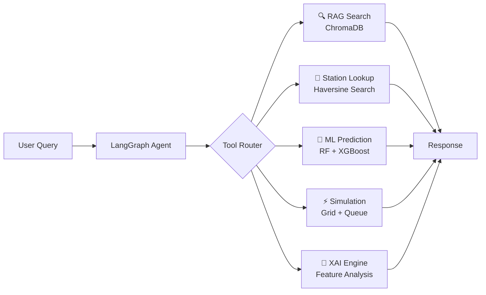

<div align="center">

# ⚡ EV Charging Station AI Agent

**From Predictive Analytics to Agentic Intelligence**

[](https://huggingface.co/spaces/rizzzvi/ev-charging-agent)
[](https://python.org)
[](https://streamlit.io)
[](https://docker.com)

</div>

---

## 🚀 Project Overview

This project represents the evolution of an EV Charging Station Classifier into a sophisticated **Agentic AI System**. Originally a machine learning pipeline to predict **Fast DC Charger** suitability, it now features a fully autonomous conversational agent capable of:

- **Reasoning** over user queries using the ReAct paradigm
- **Retrieving** domain-specific EV knowledge via RAG (Retrieval-Augmented Generation)
- **Predicting** station suitability using ensemble ML models
- **Simulating** real-time grid load, queue times, and carbon offset

The agent gathers necessary data points conversationally, executes the right tools at the right time, and delivers actionable infrastructure insights.

---

## 🌟 Key Features

| Feature | Description |
|:---|:---|
| 🤖 **Agentic Orchestration** | Built with **LangGraph** — maintains conversation state and dynamically selects tools |
| 📚 **RAG Knowledge Base** | **ChromaDB** stores and retrieves 80+ EV infrastructure facts for contextual answers |
| 🧠 **Ensemble ML Prediction** | Combines **RandomForest + XGBoost** for high-precision Fast DC classification |
| 🗺️ **Geospatial Station Search** | Haversine-based search over **240K+ real-world stations** with interactive map |
| ⚡ **Grid & Queue Simulation** | M/M/c queuing model + transformer load simulation with real-time metrics |
| 🌱 **Carbon Impact Calculator** | Country-specific CO₂ savings vs. gasoline vehicles with tree-equivalence |
| 🧬 **Explainable AI (XAI)** | Feature contribution analysis explaining why the ML model made its decision |
| 🔒 **Rate Limiting** | Built-in 5-second cooldown to protect API quotas |

---

## 🛠️ Technology Stack

| Layer | Technology |
|:---|:---|
| **Agent Framework** | LangGraph, LangChain |
| **Core LLM** | Groq (Llama 3.1 8B Instant) |
| **Vector Database** | ChromaDB |
| **Machine Learning** | Scikit-learn, XGBoost |
| **Simulation Engine** | M/M/c Queuing Theory, Grid Load Model |
| **Data Processing** | Pandas, NumPy |
| **Embeddings** | ONNX MiniLM-L6-V2 (Local, No API) |
| **Frontend & Backend** | Streamlit |
| **Deployment** | Docker, Hugging Face Spaces |

---

## 📈 System Architecture



---

## 📊 System Evolution

### Phase 1 — Core ML Pipeline
- Developed baseline classification using **RandomForest** and **XGBoost**
- Handled class imbalance with `class_weight='balanced'`
- Established evaluation metrics: **ROC AUC, F1-score, Precision, Recall**

### Phase 2 — Optimization & Feature Engineering
- **Interaction terms**: `Latitude × Longitude`, `Ports × Latitude`
- **Polynomial features**: `Ports²`, `Latitude²`, `Longitude²`
- **Hyperparameter tuning** via `RandomizedSearchCV`
- **Ensemble modeling** using weighted probability averaging

### Phase 3 — Agentic Integration *(Current)*
- Wrapped ML pipeline as a **LangChain Tool**
- Integrated **RAG layer** with 80+ curated EV knowledge facts
- Built **LangGraph state machine** for multi-turn conversation management
- Added **real-time simulation engine** (queuing + grid + carbon)
- Deployed as **Docker container** on Hugging Face Spaces

---

## ⚙️ Setup & Installation

### 1. Clone the Repository
```bash
git clone https://github.com/adnan275/EV_charging_station_agent.git
cd EV_charging_station_agent
```

### 2. Install Dependencies
```bash
python -m venv venv
source venv/bin/activate  # Windows: venv\Scripts\activate
pip install -r requirements.txt
```

### 3. Set Environment Variables
```bash
# Create a .env file in the root directory
echo "GROQ_API_KEY=your_groq_api_key_here" > .env
```

### 4. Run the Application
```bash
streamlit run app.py
```

The app will launch at `http://localhost:8501`

---

## 🤖 How to Use the Agent

| Action | Example Query |
|:---|:---|
| **Find Stations** | *"Are there any charging stations near 28.61, 77.20?"* |
| **ML Prediction** | *"Predict if 12.97, 77.59 with 8 ports is suitable for Fast DC"* |
| **Grid Simulation** | *"Run a load simulation for 10 ports at 350kW"* |
| **Explainable AI** | *"Why did the model predict that?"* |
| **EV Knowledge** | *"What is the difference between CCS2 and CHAdeMO?"* |

---

## 📁 Project Structure

```
EV_charging_station_agent/
├── app.py                          # Main Streamlit application + Agent logic
├── simulation_engine.py            # Queuing, Grid, Carbon simulation models
├── charging_station.csv            # 240K+ real-world station records
├── rf_balanced_retrained_fe.joblib # Trained RandomForest model
├── xgb_cs_retrained_fe.joblib      # Trained XGBoost model
├── scaler.joblib                   # Feature scaler
├── label_encoder.pkl               # Label encoder for country codes
├── optimal_threshold.pkl           # Ensemble decision threshold
├── requirements.txt                # Python dependencies
├── Dockerfile                      # Container configuration
└── README.md                       # This file
```

---

## 🌐 Live Demo

**Try the agent live →** [huggingface.co/spaces/rizzzvi/ev-charging-agent](https://huggingface.co/spaces/rizzzvi/ev-charging-agent)

---

<div align="center">

**Built by [Adnan Rizvi](https://github.com/adnan275)**

</div>
